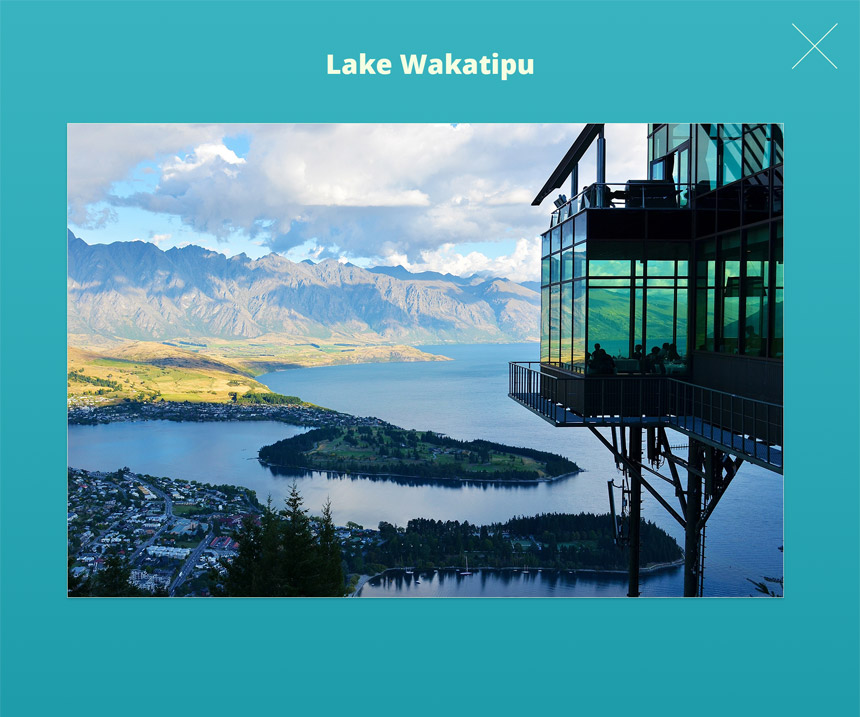

Trinity - Teste para desenvolvimento frontend - Estágio
======================

## Objetivo 1
- Converter o seguinte design para HTML/CSS/JS.

## Objetivo 2
- Criar um serviço que consome a API [News API](https://newsapi.org/docs/endpoints/top-headlines), para listagem das notícias.
- Criar componente que utiliza o serviço criado e apresenta a lista de notícias com as informações: título, conteudo, data de publicação e imagem.

### Tela principal

### Modal que é aberto quando há um evento de click na imagem.

## Requisitos
1. Use HTML5 / CSS3. A utilização do pré-processador SASS será tratado como bônus para aprovação do candidato. 
2. A tela deve ser responsiva e adaptada para dispositivos móveis (Android e iOS). É ideal que haja suporte responsivo também para tablets.
3. Não utilize JQuery.
4. Faça da página o menor tamanho possível - assegure-se de que as imagens estejam otimizadas corretamente, recursos minificados, etc.

- A fonte usada no projeto deve ser a Open Sans.
- As seguintes imagens deverão são usadas no projeto:
  -  https://pixabay.com/en/new-zealand-lake-mountain-landscape-679068/
  -  https://pixabay.com/en/new-zealand-lake-web-kai-dock-583176/
  -  https://pixabay.com/en/new-zealand-doubtful-sound-fjord-583181/
  -  https://pixabay.com/en/sun-rise-beach-new-zealand-auckland-661541/

## Browsers suportados
Certifique-se de que os elementos funcionem e sejam exibidos corretamente nos seguintes navegadores:

- Google Chrome (latest version)
- Safari (latest version)
- Microsoft Edge
- Firefox (latest version) - Opcional

## Padrões de código

Ao trabalhar no projeto, use um estilo de codificação consistente. Use algumas styleguides como [Guia de Código] (http://codeguide.co/) ou [Diretrizes CSS] (http://cssguidelin.es/).

## Garantia da Qualidade

O que você precisa fazer para obter uma pontuação alta? Basta atender todas as questões abaixo:

### Geral

- São cumpridos todos os requisitos definidos acima?
- A página está funcionando sem erros JS?

### Controle do navegador

- A página é exibida e funciona corretamente em navegadores suportados?

### Padrões de codificação

- A página está usando um estilo de codificação HTML consistente?
- A página está usando um estilo de codificação CSS consistente?
- A página está usando um estilo de codificação JS consistente?

### Otimização

- Os arquivos de imagem estão suficientemente compactados e sem perda drástica de qualidade?
